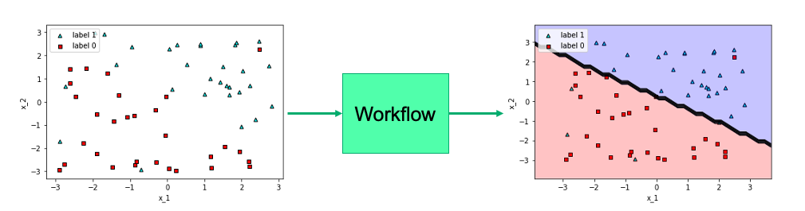

# Orquestra Tutorial 1 - Running an existing workflow

Hello! Welcome to your first orquestra tutorial. In this tutorial you'll learn how to run a very simple workflow in Orquestra.

One of Orquestra's main benefits is the ability to reproduce experiments and reuse code. In this tutorial we will run a very simple workflow which utilizes previously written functions. All we need to run them is a YAML file which we'll submit to the quantum engine for processing.

# The model

The code that we'll run is a machine learning workflow that reads a dataset in csv format, then trains a model on it, uses this model to make predictions, and finally scores the model by finding the accuracy (on the same training dataset). We will use Scikit-learn for building the models and Pandas for processing the data. The dataset looks like the image below, and the model we'll build is a simple logistic regression model.

In Tutorial 2 we'll get to look at the model more carefully, but for now, consider it a black box which has the following as inputs and outpus:

- **Input:** A csv file with our data.
- **Output:**
  - A list with the predictions for each of our data points.
  - A float with the accuracy of our model (in the training dataset)

# Running the workflow

To run a workflow, we only need two things, a YAML template and a command line with the quantum engine CLI installed. Let's learn them one by one. 

## YAML template
The YAML template is the way we tell Orquestra what code we want to run, where it's located, and which parameters we want to use. The three main elements in this template are the following:

1. **Resources**: The Github repositories where our code lives.
2. **Metadata:** Data to help us label the workflow, such as the name of the job in Orquestra.
3. **Spec:** Data for the job, such as what templates to run, inputs, and parameters.

